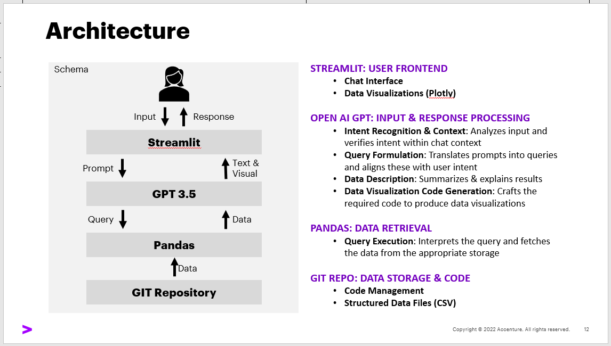

# ChatGPT-like Assistant with SQL Query Integration - Technical Documentation

## 1. Introduction

The ChatGPT-like Assistant offers a natural language interface to interact with a conversational AI powered by OpenAI's GPT model. Users can engage in conversations, explore data, and perform data-related tasks, such as loading CSV data, visualizing data plots, and executing SQL queries.
This documentation provides a comprehensive insight into the code structure, functionality, modules, and usage.


## Key Features

1. **Conversational Interaction**: Users can seamlessly engage with the AI assistant by typing messages within the provided chat input field. The AI processes the messages and responds with coherent, GPT-3-generated text, creating a natural conversational experience.

2. **Real-time Chat Display**: The application displays the ongoing conversation between the user and the AI in a user-friendly chat interface. Each message is attributed to a role, such as "user" or "assistant," enhancing the interactive feel.

3. **AI Response Generation**: Utilizing the OpenAI GPT-3 model, the AI generates responses that are contextually relevant to the conversation. These responses reflect the input provided by the user and maintain a coherent and engaging dialogue.

4. **SQL Query Extraction**: A notable aspect of this application is its ability to extract structured SQL queries from the AI assistant's textual responses. This feature enhances the AI's capabilities, enabling users to seamlessly initiate SQL-based data interactions within the conversational context.

5. **DataFrame Integration**: The application loads tabular data from a CSV file and converts it into a Pandas DataFrame. Users can prompt the AI to execute SQL queries on this DataFrame, enabling dynamic exploration, analysis, and filtering of the dataset.

6. **Interactive Streamlit Interface**: The application leverages the Streamlit framework to create an intuitive and visually appealing user interface. Users can easily provide input, visualize the conversation, and observe query results in real time.


## 2. Dependencies

The application requires the following dependencies:

- `streamlit`: For creating the user interface and chat interactions.
- `os`: For directory and file operations.
- `openai`: For communication with the OpenAI GPT API.
- `pandasql`: For executing SQL queries on Pandas DataFrames.
- `json`: For handling JSON files.
- `re`: For regular expression-based text processing.
- `pandas`: For data manipulation and analysis.
- `plotly.express`: For generating interactive data visualizations.

## 3. Modules

### `daten_laden` (Data Loading)

This module handles data loading from CSV files.

- `list_csv_files(directory)`: Lists CSV files in the specified directory.
- `load_csv_file(file_path)`: Loads CSV data into a Pandas DataFrame.

### `daten_visualisieren` (Data Visualization)

This module generates Plotly scatter plots.

- `generate_plotly_plot(df)`: Generates a scatter plot from a DataFrame.

### `query_intent_confirmation` (Intent Confirmation)

This module confirms user intents using OpenAI's GPT model.

- `ask_for_intent_confirmation(prompt, model_engine, temperature)`: Asks the AI for intent confirmation.

### `utility_functions` (Utility Functions)

This module provides various utility functions.

- `load_json(filename)`: Loads JSON data from a file.
- `parse_sql_query(response)`: Parses SQL queries from AI-generated responses.
- `execute_sql_query_on_dataframe(sql_query, df)`: Executes SQL queries on DataFrames.


## 4. Setup and Execution

To set up the project and run the application, follow these steps:

1. Clone the repository:
   ```bash
   git clone https://github.com/bohniti/LAIwand.git
2. Navigate to the project directory: Use the cd command to navigate into the project directory.
   ```bash
   cd LAIwand
3. Create and activate the Anaconda environment: Use the following commands to create the environment and activate it.
    ```bash
    conda env create -f environment.yml
    conda activate laiwand-env
4. Run the Streamlit app: Launch the Streamlit app using the following command.
    ```bash
    Copy code
    streamlit run .application/streamlit_app.py

## 5. Application/Code Architecture Overview

The application follows a multi-component architecture:

1. **User Interface (Streamlit)**: Provides the chat-based interaction with users.
2. **Assistant Logic**: Manages conversation history, AI responses, and user intents.
3. **Data Handling (CSV and Pandas)**: Loads CSV data into Pandas DataFrames for interaction.
4. **Intent Confirmation (OpenAI)**: Uses GPT-3 for confirming user intents.
5. **Data Visualization (Plotly)**: Generates Plotly scatter plots based on user requests.
6. **SQL Query Execution (PandasQL)**: Executes SQL queries on loaded DataFrames.

### Communication Flow

1. Users interact with the Streamlit interface by typing messages in the chat input field.
2. The application sends user messages to the OpenAI GPT API for response generation.
3. The AI-generated response is received and displayed in the chat interface.
4. The application parses the AI response for intent confirmation using ask_for_intent_confirmation.
5. If confirmed, the AI-generated response is processed further based on user prompts.

## 6. Architecture Diagram


_(German Version is in **/documentation**)_

## Data Loading and Interaction

Users can choose a CSV file to load data into a DataFrame.

**Relevant Functions:** `list_csv_files(directory)`, `load_csv_file(file_path)`

## Data Visualization

Users can request data visualization via a scatter plot.

**Relevant Functions:** `generate_plotly_plot(df)`

## Intent Confirmation

Users can confirm the AI's suggested intent.

**Relevant Functions:** `ask_for_intent_confirmation(prompt, model_engine, temperature)`

## SQL Query Execution

Users can execute SQL queries on loaded data.

**Relevant Functions:** `parse_sql_query(response)`, `execute_sql_query_on_dataframe(sql_query, df)`
